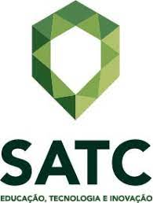

# infosatc-lp-avaliativo-01
 
 - Nome do curso: informatica
 -Nome da disciplina: Linguagem de Programação  
 - Ano: 30/08/2021
 - Descrição: Atividade avaliativa 01 da disciplina de linguagem de programação do curso técnico de informática SATC 2021
 -Linguagem:python
